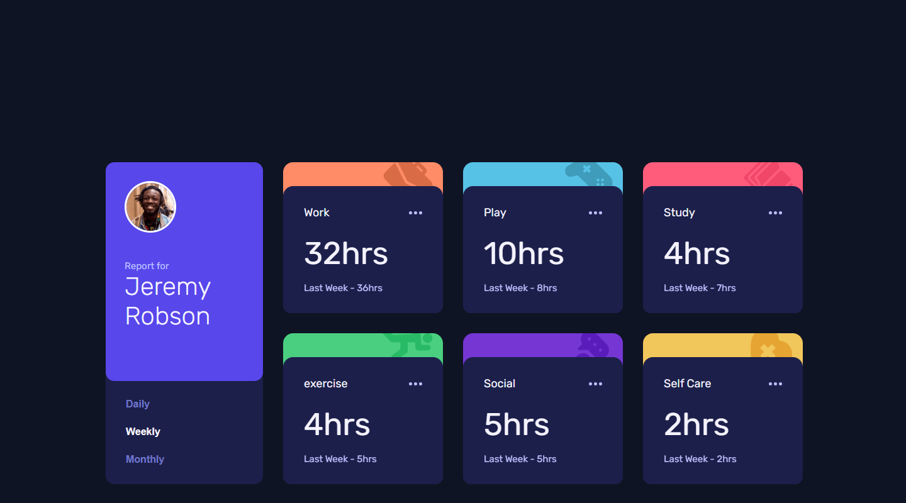

# Frontend Mentor - Time tracking dashboard solution

This is a solution to the [Time tracking dashboard challenge on Frontend Mentor](https://www.frontendmentor.io/challenges/time-tracking-dashboard-UIQ7167Jw). Frontend Mentor challenges help you improve your coding skills by building realistic projects.

## Table of contents

- [Overview](#overview)
  - [The challenge](#the-challenge)
  - [Screenshot](#screenshot)
  - [Links](#links)
- [My process](#my-process)
  - [Built with](#built-with)
  - [What I learned](#what-i-learned)
  - [Continued development](#continued-development)
  - [Useful resources](#useful-resources)
- [Author](#author)
- [Acknowledgments](#acknowledgments)

## Overview

### The challenge

Users should be able to:

- View the optimal layout for the site depending on their device's screen size
- See hover states for all interactive elements on the page
- Switch between viewing Daily, Weekly, and Monthly stats

### Screenshot

### Links

- Solution URL:[https://github.com/javascriptor1/time-tracking-dashboard-main/]
- Live Site URL:[https://time-tracking-dashboard-mainn.netlify.app/]

## My process

Hello everyone 👋, I'm Mohammed and this is my solution to this nice challenge.

Starting from this challenge, I decided to stop using flexbox for general layout of all future challenges. Instead , I will use CSS grid as I need to practice and do more exercises on CSS grid to improve.

I will briefly talk about my current process of solving FEM challenges and I hope it will help and inspire other beginners(like me 😊). To make this process actionable so other can follow , I will list the steps I take to solve the challenge :-

1- I download the challenge resource file and extract it in specially folder so I can use it in future if needed without having to re-download it again.

2- After files extracted, I read about requirements to solve the challenge.

3- After reading the requirements, I open the design folder to see the final product both for mobile and desktop screens. I also note down the number of active state elements so I don't forget to do it while solving the main challenge.

4- After I see both photos for screen designs, I take some notes on how best to do the HTML markup and how to structure the elements in the page. This is very very important issue and help in later steps. I pick up best semantic tags which serve the purpose of the content.

5- I then create a css styling and javascript files , link them to the html file then I initialize a new git repo and make initial commit on the master branch.

6- Then I do the actual markup of all texts in challenge file for mobile screens. for example , if a text is best displayed as H1 tag , I wrap the text in h1 tag using a shortcut in vscode,etc.. I also add images and icons at this stage. then I create a new git branch for mobile-design before I start styling.

**Note** : I always do mobile-first solution and I don't combine mobile and desktop styling at same stage.

7- After I finish the markup stage , I go to styling stage targeting mobile screens. I use live server on vscode , I go live and open the page in my chrome , then use **Pixel perfect** extension to load the design file for mobile screen as overlay on top of my actual page. I make sure the overlay image is exactly 100% on top of my html page. I make sure I choose the right screen resolution which is 375px.

8- At this stage, I use **Responsively app** to see how the page will look like on different screen sizes. I usually have the following screen sizes opened at the same time:

- Iphone SE 375px **Fem design size for mobile**
- Iphone Pro Max 428px
- Ipad mini 768px
- Ipad Air 820px
- Ipad Pro 1024px
- My own screen size 1366px
- MacBook Pro 1440px **Fem design size for desktop**

9- After I finished mobile screen design , I commit all changes, checkout to master branch , then merge mobile-design branch with master created before.

10- I then create a new branch for desktop design , load the design image as overlay on chrome using the extension and I start coding on custom screen size of 1440px I created for this purpose.

11- I repeat step 9 with desktop branch.

**Note** : I will add a new git branch in future for accessibility,SEO and performance so I improve this area also.

12- I move to Javascript part of the challenge after I create a new git branch for it.

13- After I solve the javascript part , I commit and merge into master branch and my solution is ready for deployment.

14- I do final checks to make sure all things are working as it should , then I deploy to netlify.

15- I then upload my solution to FEM website

This is a brief process overview I developed over time.  I'm know its not perfect for sure but its good start for a beginner like me with big room for improvement in future.

This process does not take into account frameworks or libraries I might use in my solution.  In case I did use such frameworks (like tailwindcss for example), I install them at initial stage.

### Built with

- Semantic HTML5 markup
- CSS custom properties
- Flexbox
- CSS Grid
- Mobile-first workflow
- [PixelPerfect](https://www.welldonecode.com/perfectpixel/) chrome extension
- [Animate.css](https://animate.style/)
- [Reponsively](https://responsively.app/)

### What I learned

- CSS grid for general layout of the project
- working with json files to import data and update the DOM

### Continued development

- Working with CSS grid
- Fetch, JSON in Javascript
- Pass arguments for callback functions with addEventlistner

### Useful resources

- [CSS grid free course](https://scrimba.com/learn/cssgrid/)
- [JSON file import](https://www.freecodecamp.org/news/how-to-read-json-file-in-javascript/)

## Author

- Frontend Mentor -[https://www.frontendmentor.io/profile/javascriptor1]
- Twitter -[https://twitter.com/javascriptor1]

## Acknowledgments

This work was inspired by the solution of [Melvin](https://www.frontendmentor.io/profile/MelvinAguilar)
