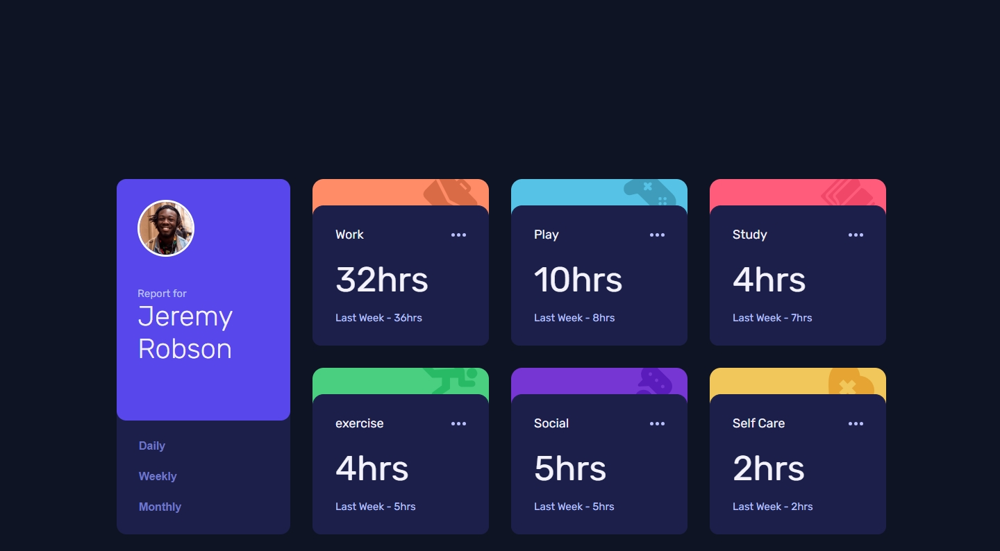

# Frontend Mentor - Time tracking dashboard solution

This is a solution to the [Time tracking dashboard challenge on Frontend Mentor](https://www.frontendmentor.io/challenges/time-tracking-dashboard-UIQ7167Jw). Frontend Mentor challenges help you improve your coding skills by building realistic projects.

## Table of contents

- [Overview](#overview)
  - [The challenge](#the-challenge)
  - [Screenshot](#screenshot)
  - [Links](#links)
- [My process](#my-process)
  - [Built with](#built-with)
  - [What I learned](#what-i-learned)
  - [Continued development](#continued-development)
  - [Useful resources](#useful-resources)
- [Author](#author)
- [Acknowledgments](#acknowledgments)

## Overview

### The challenge

Users should be able to:

- View the optimal layout for the site depending on their device's screen size
- See hover states for all interactive elements on the page
- Switch between viewing Daily, Weekly, and Monthly stats

### Screenshot

### Links

- Solution URL: [https://github.com/javascriptor1/social-media-dashboard-with-theme-switcher-master]
- Live Site URL: [https://time-tracking-dashboard-mainn.netlify.app/]

## My process

### Built with

- Semantic HTML5 markup
- CSS custom properties
- Flexbox
- CSS Grid
- Mobile-first workflow
- PixelPerfect chrome extension (https://www.welldonecode.com/perfectpixel/)

**Note: These are just examples. Delete this note and replace the list above with your own choices**

### What I learned

- CSS grid for general layout of the project
- working with json files to fetch data and update the DOM

### Continued development

- Working with CSS grid
- Fetch, JSON in Javascript

### Useful resources

- [CSS grid free course](https://scrimba.com/learn/cssgrid/)
- [JSON file import](https://www.freecodecamp.org/news/how-to-read-json-file-in-javascript/)

## Author

- Frontend Mentor - [https://www.frontendmentor.io/profile/javascriptor1]
- Twitter - [https://twitter.com/javascriptor1]

## Acknowledgments

This work was inspired by the solution of Melvin (https://www.frontendmentor.io/profile/MelvinAguilar)
